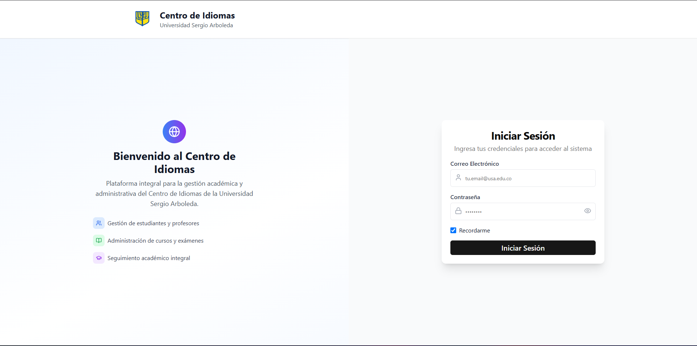

# Centro de Idiomas Universidad Sergio Arboleda



## 📜 Descripción

Sistema de gestión académica desarrollado para el **Centro de Idiomas de la Universidad Sergio Arboleda**.  
Es una **plataforma integral** diseñada para optimizar los procesos académicos y administrativos del Centro de Idiomas, ofreciendo una experiencia moderna y eficiente tanto para estudiantes como para docentes y administradores.

### Funcionalidades principales:
- 📚 **Gestión de estudiantes y profesores**: Registro, actualización y control de la información académica.  
- 📝 **Administración de cursos y exámenes**: Creación, asignación y seguimiento de actividades académicas.  
- 📊 **Seguimiento académico integral**: Visualización de calificaciones, asistencia y progreso académico.  
- ⚙️ **Plataforma escalable y segura**: Construida con tecnologías modernas para garantizar rendimiento y confiabilidad.

## 🚀 Tecnologías Utilizadas

Este proyecto está construido con la siguiente pila de tecnologías:

-   **Next.js**: Framework de React para el desarrollo de aplicaciones web.
-   **TypeScript**: Lenguaje de programación tipado que mejora la calidad y mantenibilidad del código.
-   **Tailwind CSS**: Framework de CSS utilitario para un diseño rápido y personalizable.
-   **Shadcn UI**: Colección de componentes de UI re-utilizables basados en Radix UI y Tailwind CSS.
-   **Supabase**: Backend como servicio (BaaS) que proporciona una base de datos, autenticación y más.
-   **Framer Motion**: Librería de animaciones de producción para React.
-   **AI SDK (Vercel)**: Para la integración de modelos de IA, como se indica en el `package.json`.
-   **React Icons**: Librería de íconos lista para usar con React.
-   **jspdf**: Generación de documentos PDF en el cliente.
-   **html2canvas**: Conversión de elementos HTML en imágenes.
-   **uuid**: Generación de identificadores únicos universales (UUID).

## 🛠️ Instalación

Para configurar el proyecto localmente, sigue estos pasos:

1.  **Clona el repositorio:**
    ```bash
    git clone https://github.com/richardcastiblancoo/Ciusa.git
    cd Centro-de-Idiomas-Universidad-Sergio-Arboleda
    ```

2.  **Instala las dependencias:**
    Utilizas `npm`, por lo tanto, ejecuta el siguiente comando:
    ```bash
    npm install
    ```

    Si necesitas instalar dependencias específicas:
    ```bash
    npm install framer-motion
    npm install react-icons
    npm install jspdf html2canvas
    npm install uuid
    ```

3.  **Configura las variables de entorno:**
    Crea un archivo `.env.local` en la raíz de tu proyecto. El archivo `.gitignore` ya está configurado para no subir `.env` o `.env.local` al repositorio, lo cual es una buena práctica.

    Añade las siguientes variables de Supabase:

    ```env
    NEXT_PUBLIC_SUPABASE_URL=
    NEXT_PUBLIC_SUPABASE_ANON_KEY=
    ```

    **¡Importante!** Si estos valores son de producción, asegúrate de reemplazarlos por las claves de tu proyecto de Supabase local o de desarrollo.

4.  **Ejecuta el servidor de desarrollo:**
    ```bash
    npm run dev
    ```

    Abre [http://localhost:3000](http://localhost:3000) en tu navegador para ver la aplicación.

## 📁 Estructura de Archivos

Este es un resumen de la estructura del proyecto:

-   `app/`: Directorio principal de las páginas de Next.js.
-   `components/`: Componentes reutilizables de React.
-   `components/ui/`: Componentes de Shadcn UI.
-   `hooks/`: Hooks personalizados de React.
-   `lib/`: Archivos de utilidades y librerías, como la configuración de Supabase.
-   `tailwind.config.ts`: Configuración de Tailwind CSS, incluyendo temas y variables.
-   `.env`: Variables de entorno para el proyecto.
-   `package.json`: Lista de dependencias y scripts del proyecto.

## ⚙️ Scripts Disponibles

En el directorio del proyecto, puedes ejecutar:

-   `npm run dev`: Inicia la aplicación en modo de desarrollo.
-   `npm run build`: Crea la aplicación optimizada para producción.
-   `npm run start`: Inicia el servidor de producción.
-   `npm run lint`: Ejecuta el linter de Next.js para revisar el código.

